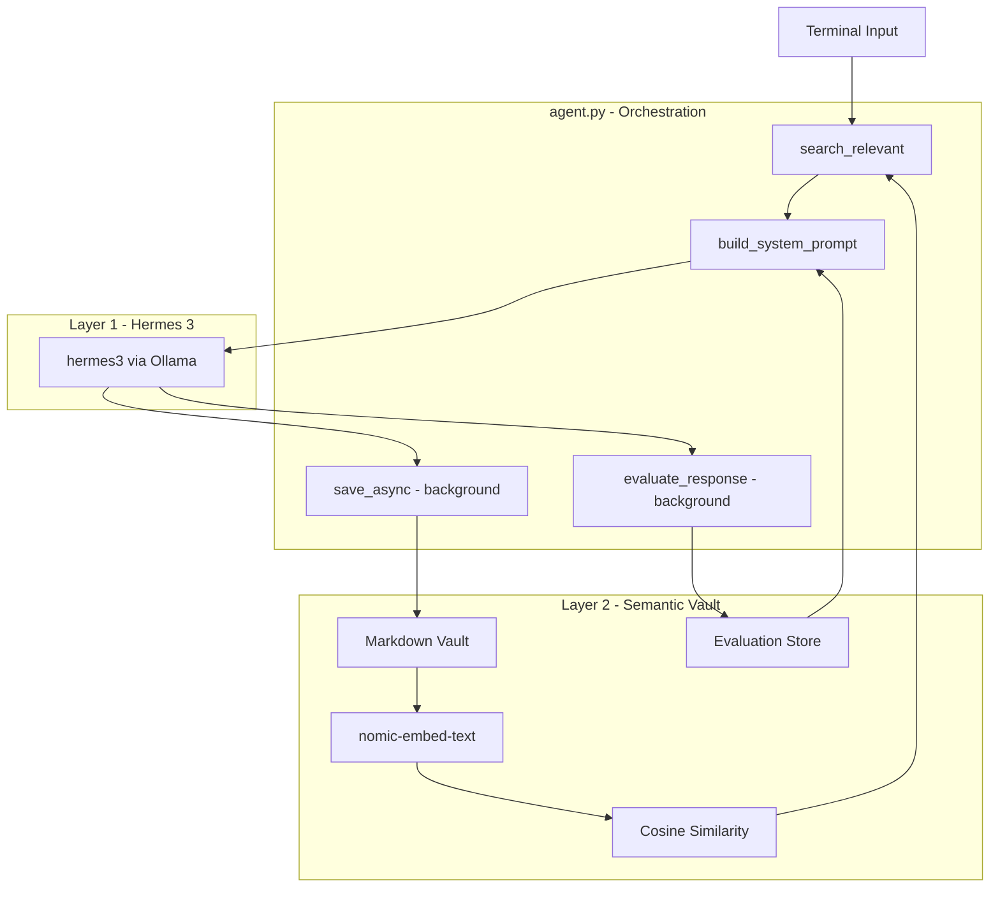
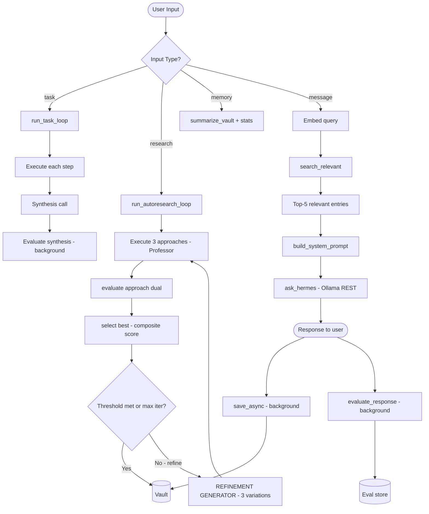

# Hermes + Rowboat: Dual-Layer AI Environment
### Semantic Memory Retrieval & Autonomous Task Execution

---

## Overview

The **Hermes + Rowboat Dual-Layer AI Environment** is a fully local, privacy-first AI agent system. It integrates a **Semantic Memory Vault** with **Hermes 3** (Nous Research) to provide context-aware responses that persist and improve across sessions.

The system is purpose-built to eliminate the core failure of standard AI tools - losing all context when closed - by applying embedding-based retrieval, session-aware memory labelling, and a self-evaluation feedback loop that dynamically adapts the reasoning prompt over time.

---

## System Specifications

| Parameter | Value |
|:---|:---|
| Reasoning Model | `hermes3` (Nous Research via Ollama) |
| Embedding Model | `nomic-embed-text` (Ollama) |
| Memory Format | Local Markdown Vault + JSON Embedding Vectors |
| Retrieval Mode | Semantic (Cosine Similarity) |
| Chat Evaluation | Self-scoring loop (1–10 per response) |
| Research Evaluation | Dual scoring - Professor multi-dim + Critic adversarial, averaged into composite |
| Research Loop | Up to 3 iterations, stops when composite score reaches 8.0/10 |
| Dependencies | Python Standard Library only - zero pip installs |
| Support OS | Windows / macOS / Linux |

---

## Memory Pipeline

> [!IMPORTANT]
> Context is retrieved semantically on every query - the system does not replay the last N messages. It finds the most relevant past entries across all sessions and injects only those into the prompt.

**Step 1: Query Embedding (`memory.search_relevant`)**
```python
# Embed the current query using nomic-embed-text
query_vec = _embed(user_input)
```

**Step 2: Cosine Similarity Retrieval (`_cosine`)**
```python
# Score every vault entry against the query vector
score = _cosine(query_vec, entry["embedding"])
```

**Step 3: Context Injection (`summarize_vault`)**
```python
# Return top-5 most relevant entries as formatted context string
context = memory.summarize_vault(query=user_input)
```

**Step 4: Prompt Assembly (`build_system_prompt`)**
```python
# Merge base prompt + quality adaptation note + memory context
system = build_system_prompt() + "\n\n--- RELEVANT MEMORY CONTEXT ---\n" + context
```

**Step 5: Reasoning (`ask_hermes`)**
```python
# Send assembled prompt + user input to Hermes via Ollama REST API
response = ask_hermes(user_input)
```

**Step 6: Parallel Save & Evaluate**
```python
# Non-blocking - both run in background daemon threads
memory.save_async("hermes", response)
threading.Thread(target=evaluate_response, args=(user_input, response)).start()
```

### Supported Interaction Modes

| Mode | Trigger | Behaviour | Output |
|:---|:---|:---|:---|
| CHAT | Any message | Semantic retrieval + single response | Contextual answer |
| TASK | `task: <goal>` | Autonomous step planning + execution + synthesis. If `research:` was run earlier in the session, all steps are grounded strictly in the research strategy's tactics via `STRATEGY_TASK_PLANNER_SYSTEM` — no generic content | Multi-step report |
| RESEARCH | `research: <goal>` | Multi-round iterative loop: generates 3 approaches, dual-scores each (professor + critic), selects best via composite score, refines in subsequent rounds until quality threshold met. Stores the winning strategy for downstream `task:` grounding | Scored iteration log + best strategy |
| RECALL | `memory` | Session-aware vault view + quality stats | Labelled history |

> [!WARNING]
> **Evaluation Latency**: The self-evaluation thread runs a second Ollama inference after every response. If you send the next message immediately, it queues behind the evaluation. For best results, allow ~10 seconds between messages when inspecting quality stats.

---

## Sample Output

The system provides a clean terminal interface. The examples below show a task loop execution and a research loop execution with dual evaluation and iteration.

**Task loop (`task:`)**

```text
=== Hermes + Rowboat Dual-Layer AI Environment ===
Hermes  : reasoning engine (Nous Research via Ollama)
Rowboat : semantic memory layer (local Markdown vault + embeddings)
Commands : 'memory' | 'task: <goal>' | 'research: <goal>' | 'quit'

You: task: Compare supervised and unsupervised learning with real-world examples

[AGENT] Decomposing goal: Compare supervised and unsupervised learning...

[AGENT] 5 steps planned:
  1. Define key characteristics of supervised and unsupervised learning
  2. Provide a real-world example for each type
  3. Discuss the role of labeled data
  4. Highlight typical applications and industries
  5. Summarise main differences

[STEP 1/5] Define key characteristics...

Supervised learning uses labeled training data where inputs are mapped to
known outputs. The model learns by minimizing prediction error...

[AGENT COMPLETE]
In conclusion, supervised learning maps known inputs to outputs using labeled
data, while unsupervised learning discovers hidden structure in unlabeled data.
```

**Research loop (`research:`) - multi-round with dual evaluation**

```text
You: research: How to grow a YouTube channel to 10,000 subscribers

[AUTORESEARCH] Goal: How to grow a YouTube channel to 10,000 subscribers
[AUTORESEARCH] Max iterations: 3 | Quality threshold: 8.0/10
[AUTORESEARCH] Evaluation: Professor multi-dim + Critic adversarial (dual scoring)
[AUTORESEARCH] Selection: Composite score + head-to-head tiebreaker

============================================================
[ITERATION 1/3]
[AUTORESEARCH] Generating 3 distinct approaches...

[AUTORESEARCH] 3 approaches for iteration 1:
  1. Viral Loop: Build a subscriber referral challenge using YouTube Community tab...
  2. Guerrilla: Partner with micro-creators for cross-promotion swaps...
  3. Trend-jack: Create rapid-response content around trending topics within 2 hours...

[APPROACH 1/3] Executing: Viral Loop...

Launch a Subscriber Squad challenge where viewers share the video to unlock
a bonus resource. Use YouTube Community tab to seed the challenge...

  [Prof avg: 7.3/10 | Critic: 5.0/10 | Composite: 6.2/10]
  Strategic: 8 | Feasibility: 7 | Viral: 7

[APPROACH 2/3] Executing: Guerrilla: Partner with micro-creators...

Identify 10 creators in your niche with 500-5,000 subscribers and propose
a no-cost cross-promotion swap: they feature your channel in their end screen...

  [Prof avg: 8.0/10 | Critic: 7.0/10 | Composite: 7.5/10]
  Strategic: 8 | Feasibility: 8 | Viral: 8

[APPROACH 3/3] Executing: Trend-jack...

Set up Google Alerts and YouTube trending for your niche keywords. When a
topic spikes, publish a response video within 2 hours using a pre-built template...

  [Prof avg: 7.7/10 | Critic: 6.0/10 | Composite: 6.8/10]
  Strategic: 8 | Feasibility: 7 | Viral: 8

[ITERATION 1 RESULTS]
  Approach 1: 6.2/10
  Approach 2: 7.5/10  <-- BEST
  Approach 3: 6.8/10
[NEW BEST] Iteration 1, Approach 2: 7.5/10

[AUTORESEARCH] Score 7.5/10 below threshold. Running iteration 2...

============================================================
[ITERATION 2/3]
[AUTORESEARCH] Refining best approach (score: 7.5/10)...

  [Prof avg: 8.3/10 | Critic: 7.8/10 | Composite: 8.1/10]

[AUTORESEARCH] Threshold 8.0/10 reached. Stopping.

============================================================
[AUTORESEARCH COMPLETE] 2 iteration(s) | Best composite: 8.1/10
============================================================
```

---

## Experimental Results

Results from live end-to-end testing on a CPU-only machine with default configuration (`max_iterations=3`, `quality_threshold=8.0`).

### Research Loop: Score Progression

**Goal:** How to grow a YouTube channel to 10,000 subscribers

| Iteration | Approach | Prof avg | Critic | Composite | Selected |
|:---|:---|:---:|:---:|:---:|:---:|
| 1 | Viral loop: Subscriber Squad referral challenge | 7.3 | 5.0 | 6.2 | |
| 1 | Guerrilla: micro-creator cross-promotion swaps | 8.0 | 7.0 | 7.5 | YES |
| 1 | Trend-jack: rapid-response content within 2 hours | 7.7 | 6.0 | 6.8 | |
| 2 | Refined: feasibility-improved cross-promotion | 8.3 | 7.8 | 8.1 | YES - threshold met |

Score trajectory: **7.5 → 8.1** (+0.6 via one refinement round). Threshold met on iteration 2 - third round not needed.

### Approach Diversity Across Runs

| Run | Approach 1 | Approach 2 | Approach 3 |
|:---|:---|:---|:---|
| Run 1 | Viral loop (referral challenge) | Guerrilla (micro-creator swaps) | Trend-jacking (rapid-response) |
| Run 2 | Hashtag challenge (UGC campaign) | Influencer affiliate program | Interactive quiz (engagement bait) |

All six approaches were distinct across both runs - no repetition of strategy, different marketing philosophies between sessions. Confirms non-repetitive generation behavior.

### Context Bleed Fix Verification

| Condition | Expected | Observed |
|:---|:---|:---|
| Before fix (pure cosine) | Reference leather wallets | Referenced AI marketing (wrong session) |
| After fix (hybrid retrieval) | Reference leather wallets | Correctly referenced leather and canvas |

### Key Observations

- Critic scores averaged **1.5–2.0 points below professor averages** - adversarial persona functioning as intended
- No head-to-head tiebreaker was triggered - composite scores were sufficiently differentiated in these runs
- Background threads confirmed non-blocking: eval results appeared in `memory` stats 10–15 seconds post-exchange with no prompt delay
- Nested JSON fallback parser was triggered once during testing and resolved correctly via the flattening logic

---

## System Architecture

### Component Overview



### Logical Flow



### Design Principles

> [!TIP]
> **Design Philosophy**
> 1. **Relevance > Recency**: In memory systems, what was said last is not necessarily what matters now. The system retrieves by semantic similarity, not timestamp.
> 2. **Non-Blocking Execution**: Embedding generation and self-evaluation run in background threads so the user never waits for memory writes.
> 3. **Local Privacy**: The entire pipeline - embedding, retrieval, reasoning, and evaluation - runs locally on Ollama. No data leaves the device.
> 4. **Self-Improvement**: Quality scores accumulate across sessions and feed back into the system prompt. Note: scores show low variance due to same-model self-evaluation, so prompt adaptation is a structural capability - not a guarantee of measurable accuracy improvement.
> 5. **Persona-Standardized Execution**: Planning quality is standardized through fixed personas rather than ad-hoc prompting. Every research task routes through a dedicated `PROFESSOR_PERSONA`, ensuring consistent reasoning depth and strategic framing across all approaches regardless of how the user phrases the goal. Evaluation uses opposing personas (`MULTI_DIM_EVAL_SYSTEM` vs `CRITIC_EVAL_SYSTEM`) to produce comparable, scoreable outputs rather than free-form narratives.

---

## Installation

**1. Install Ollama** from [https://ollama.com](https://ollama.com) and start it:
```bash
ollama serve
```

**2. Pull the required models (one-time downloads):**
```bash
ollama pull hermes3
ollama pull nomic-embed-text
```

**3. Navigate to this folder:**
```bash
cd hermes-rowboat-env
```

**4. Run:**
```bash
python agent.py
```

> [!IMPORTANT]
> No `pip install` required. The entire project uses Python's standard library (`json`, `os`, `re`, `threading`, `urllib`, `datetime`).

---

## Controls & Customisation

| Setting | Location | Default | Effect |
|:---|:---|:---|:---|
| `model` | `config.json` | `hermes3` | Swap to any locally pulled Ollama model |
| `embed_model` | `config.json` | `nomic-embed-text` | Embedding model for semantic search |
| `temperature` | `config.json` | `0.7` | 0 = deterministic, 1 = creative |
| `system_prompt` | `config.json` | (see file) | Base persona and context for Hermes |
| `top_k` retrieval | `memory.py` | `5` | Number of relevant entries injected per query |
| Quality threshold (low) | `agent.py` | `< 6.0` | Score below which system prompt adds improvement note |
| Quality threshold (high) | `agent.py` | `>= 8.5` | Score above which system prompt adds reinforcement note |
| `max_iterations` | `agent.py` | `3` | Maximum research rounds before stopping - increase for deeper refinement |
| `quality_threshold` | `agent.py` | `8.0` | Composite score at which the research loop stops early |

---

## Features

### Core Memory Capabilities
- **Semantic Retrieval**: Embeds every query and finds the top-5 most cosine-similar vault entries - not the last N messages.
- **Session Awareness**: Writes a session marker on startup so `memory` command correctly labels `[CURRENT SESSION]` vs `[PREVIOUS SESSION]` entries.
- **Persistent Vault**: All entries survive across restarts as `.md` + `.json` pairs. The system builds intelligence over time.
- **Evaluation Store**: Each response is scored 1–10 and stored as a separate `_eval.json` file, excluded from semantic search but used for quality stats.

### Research → Task Pipeline

Run `research:` first to find the best strategy, then run `task:` to execute it. When both commands are used in the same session, `task:` is automatically grounded in the research output:

```
You: research: How to grow a YouTube channel to 10,000 subscribers
[AUTORESEARCH] ... selects best strategy (composite: 8.1/10) ...

You: task: Create a 7-day content calendar
[AGENT] Decomposing goal using research strategy as context...
[STEP 1/5] Day 1: Instagram Story quiz — What is your growth type? (viral loop tactic)
...
```

Without a prior `research:` run, `task:` behaves as before: plain goal planning with session context.

### Implementation Details
- **`memory.search_relevant(query, top_k)`**: Hybrid retrieval. Splits vault entries into current session (timestamp >= most recent `_system.md` marker) and past sessions. Current session entries are always returned first in chronological order. Past session entries are ranked by cosine similarity and fill any remaining slots up to `top_k`. This prevents old similar content from crowding out the live conversation.
- **`memory.save_async(role, content)`**: Writes the `.md` file and generates the embedding in a background daemon thread - non-blocking.
- **`memory.save_eval(score, reasoning)`**: Stores a structured quality record as `_eval.json` with score, reasoning, question, and response preview.
- **`memory.get_quality_stats()`**: Reads all `_eval.json` files, computes average and recent average, and returns a trend label (`improving`, `stable`, `declining`).
- **`agent.build_system_prompt()`**: Reads quality stats and dynamically appends an adaptation note when the rolling average is below 6.0 or above 8.5.
- **`agent.run_task_loop(goal)`**: Strategy-aware task executor. If `research:` was run earlier in the session, `_last_research_best` is set and the planner uses `STRATEGY_TASK_PLANNER_SYSTEM` — every step must reference a named tactic from the research strategy, and each step is executed with the full strategy context injected. If no research was done, falls back to recent session buffer context, then plain goal. Synthesis explicitly references the tactics that were executed.
- **`agent.run_autoresearch_loop(goal, max_iterations=3, quality_threshold=8.0)`**: Multi-round iterative research loop. Round 1 generates 3 fresh approaches (viral / guerrilla / trend-jack). Each approach is executed by the Professor persona and scored by `evaluate_approach_dual()`. If the best composite score is below `quality_threshold`, the loop generates 3 refinements of the best result and runs another round. Stops when threshold is met or `max_iterations` is reached. Stores the winning result in `_last_research_best` so a subsequent `task:` command can ground itself in it.
- **`agent.evaluate_approach_dual(approach, response)`**: Dual evaluation to reduce single-model bias. Runs two separate Hermes calls with opposing personas - `MULTI_DIM_EVAL_SYSTEM` (professor, 3 dimensions: strategic quality, feasibility, viral potential) and `CRITIC_EVAL_SYSTEM` (adversarial critic, finds weaknesses). Composite score = average of professor mean and critic score.
- **`agent._select_best(results)`**: Selects the highest composite-scoring result. If the top 2 scores are within 0.5 points of each other, runs `_head_to_head()` using `TIEBREAKER_SYSTEM` to pick the real-world winner. The tiebreaker prints the winner's approach text so the output is unambiguous regardless of approach ordering.

---

## Persistence & Data

| File / Directory | Description |
|:---|:---|
| `memory/*_user.md` | User messages - readable text with frontmatter |
| `memory/*_user.json` | User message embedding vectors (768 floats) |
| `memory/*_hermes.md` | Hermes responses - readable text with frontmatter |
| `memory/*_hermes.json` | Hermes response embedding vectors |
| `memory/*_eval.json` | Quality scores - structured JSON, no `.md` pair |
| `memory/*_system.md` | Session start markers - used for session labelling |
| `config.json` | All runtime configuration |

---

## Project Structure

```
hermes-rowboat-env/
├── agent.py                                      # Orchestration - input loop, Hermes calls, task/research loops, eval threading
├── memory.py                                     # Memory layer - embed, save, search, evaluate, summarise
├── config.json                                   # All configuration (model, temperature, embed model, system prompt)
├── generate_plan_doc.py                          # Script to regenerate the plan document .docx
├── Hermes + Rowboat_ Self-Improving AI System Plan.docx  # Plan document (Word format)
├── Plan_Document_Hermes_Rowboat.md               # Plan document (Markdown format)
├── README.md                                     # Project documentation (you are here)
└── memory/                                       # Auto-created vault
    ├── *_user.md           ← user messages
    ├── *_user.json         ← user message embeddings
    ├── *_hermes.md         ← hermes responses
    ├── *_hermes.json       ← hermes response embeddings
    ├── *_agent.md          ← task loop step results
    ├── *_agent_summary.md  ← task loop final syntheses
    ├── *_autoresearch.md   ← research loop approach results
    └── *_eval.json         ← quality scores (no .md pair)
```

---

## This System vs Cloud AI Tools

> [!TIP]
> The most common question is: *"Why not just use ChatGPT or Claude?"* This table answers that directly.

| Concern | Cloud AI (ChatGPT, Claude, etc.) | This System |
|:---|:---|:---|
| **Memory across sessions** | Forgotten unless you pay for memory features | Persistent across every session, always |
| **Data privacy** | Conversations sent to and stored on external servers | Everything stays on your machine - localhost only |
| **Internet required** | Yes - always | Only for initial model download. Fully offline after that |
| **Cost** | Subscription or API credits | Free - runs on your own hardware |
| **Context relevance** | Last N messages in the window | Semantically retrieved - finds what matters, not just what's recent |
| **Autonomous tasks** | Requires plugins or paid tiers | Built-in `task:` loop, no add-ons needed |
| **Customisation** | Limited to settings provided | Full access - change model, prompt, temperature, retrieval depth |

> [!WARNING]
> **Trade-off**: Cloud models (GPT-4, Claude Opus) are significantly more capable than `hermes3`. This system prioritises **privacy and persistence** over raw reasoning power. For sensitive or long-running personal projects, the trade-off is worth it. For one-off complex tasks, a cloud model may produce better single-turn answers.

---

## How to Verify the System Is Working

Run these checks after your first session to confirm all three layers are active:

**Check 1 - Reasoning layer (Hermes)**
```bash
ollama list
```
You should see `hermes3` in the list with a size of ~4.3 GB.

**Check 2 - Embedding layer (nomic-embed-text)**
```bash
ollama list
```
You should see `nomic-embed-text` in the list with a size of ~274 MB.

**Check 3 - Memory vault is saving**

After sending one message, check the `memory/` folder:
```bash
ls memory/
```
You should see at least three files: one `_system.md` (session marker), one `_user.md` + `_user.json` pair, and one `_hermes.md` + `_hermes.json` pair.

If the `.json` files are missing, `nomic-embed-text` is not running - pull it with `ollama pull nomic-embed-text`.

**Check 4 - Evaluation layer is storing scores**

After sending 3+ messages, wait 15 seconds then type `memory`. You should see:
```
--- QUALITY STATS ---
Evaluations : 3
Average     : X/10
```
If `Evaluations : 0`, the background eval thread is still running or the evaluation JSON parsing failed. Wait longer and try again.

**Check 5 - Semantic retrieval is working**

Ask about a topic from a previous session. If Hermes references it accurately without you repeating it, the semantic retrieval is pulling relevant vault entries correctly.

---

## Performance Expectations

> [!IMPORTANT]
> All inference runs on your local machine. Speed depends on your hardware (CPU vs GPU, available RAM).

| Operation | Typical Duration | Notes |
|:---|:---|:---|
| First response (cold start) | 20–60 seconds | Model loads into memory on first call |
| Subsequent responses | 5–15 seconds | Model stays loaded between calls |
| Embedding generation | 1–3 seconds | Runs in background - does not block you |
| Self-evaluation | 5–15 seconds | Runs in background - does not block you |
| Task loop (5 steps) | 3–10 minutes | Each step is a full Hermes inference |
| Research loop (1 iteration, 3 approaches) | 15–45 minutes | Each approach needs execution + 2 eval calls (professor + critic) |
| Research loop (3 iterations) | 45–120 minutes | Worst case: threshold never met, 3 full rounds run |
| `memory` command | Instant | Reads local files only |

If your machine has a GPU with CUDA support, Ollama will use it automatically and responses will be 3–5x faster. To check:
```bash
ollama ps
```
The output will show whether the model is running on CPU or GPU.

---

## Vault Size & Maintenance

Each exchange produces two files:

| File type | Typical size |
|:---|:---|
| `*_user.md` / `*_hermes.md` | 1–5 KB |
| `*_user.json` / `*_hermes.json` | ~6 KB (768 floats) |
| `*_eval.json` | ~1 KB |

A session of 20 exchanges generates roughly **280 KB** of vault data. After 100 sessions the vault will be around **28 MB** - small enough to never need attention on any modern machine.

**To clear the vault and start fresh:**
```bash
rm memory/*.md memory/*.json
```

> [!WARNING]
> This permanently deletes all memory and evaluation history. The system will behave as if it has never been run before. Quality stats will reset to zero.

---

## Known Limitations

> [!WARNING]
> Understanding these limitations prevents misuse and sets correct expectations.

| Limitation | Detail |
|:---|:---|
| **Self-evaluation uses same model** | Both the professor and critic personas in `evaluate_approach_dual()` use the same Hermes model. Using opposite personas reduces score variance compared to single-pass self-evaluation, but does not eliminate same-model bias entirely. An external evaluator model would be needed for fully independent scoring. |
| **Semantic context bleed (mitigated)** | The vault accumulates entries across all sessions. Pure cosine similarity search can return old entries from past sessions that are topically similar but contextually wrong. **Fixed:** `search_relevant()` now uses hybrid retrieval - current session entries are always injected first, and past session entries only fill the remaining slots via semantic search. This ensures the live conversation is never crowded out by old similar content. |
| **Refinement generator hard-capped at 3** | If the model formats its JSON with separate title and description lines, the parser picks up 6 items instead of 3. **Fixed:** the prompt was hardened with an explicit one-sentence format example, and a code-level hard cap (`approaches[:3]`) now enforces the 3-item limit regardless of model output. |
| **Task loop outputs not stripped of model self-labels** | `run_task_loop()` printed step results and the final synthesis directly without stripping `[HERMES]` or similar labels that the model occasionally prefixes to its own output. **Fixed:** `re.sub(r'^\[[A-Z]+\]\s*', '', ...)` is now applied to both the step result and synthesis before printing and saving. |
| **"Saving session and exiting." misleading message** | The quit message implied a guaranteed save, but async save threads are daemon threads - they are killed when the process exits with no flush guarantee. **Fixed:** message changed to `"Exiting."` to accurately reflect the process behaviour. |
| **"1 approaches" grammar edge case** | If JSON parsing of the approach list fails completely and falls back to the raw string, `len(approaches) == 1` and the output would read `"1 approaches"`. **Fixed:** singular/plural is now resolved inline - `"approach"` vs `"approaches"` based on count. |
| **No internet access** | Hermes only knows what it was trained on (knowledge cutoff applies). It cannot browse the web or access real-time information. |
| **Task loop depends on JSON output** | The `task:` planner asks Hermes to return a JSON array. If the model returns a narrative instead, the system falls back to treating the full goal as a single step. |
| **Vault grows unbounded** | There is no automatic cleanup. Old entries remain forever unless manually deleted. The semantic search may eventually slow slightly with very large vaults (10,000+ entries). |
| **Single-user only** | The vault has no access control. Multiple users sharing the same machine would share the same memory vault. |
| **Reasoning quality ceiling** | `hermes3` is a 4.3 GB local model. It is capable but not comparable to GPT-4 or Claude Opus for complex multi-step reasoning. |
| **Evaluation latency** | Background eval threads queue behind each other. In long sessions, eval results may appear in `memory` stats with a delay of several minutes. |

---

## Frequently Asked Questions

**Why does the `memory` command show double `=== NEW SESSION ===`?**
Each run of `agent.py` writes one session marker. If you have run the agent multiple times, you will see one marker per previous session within the last 10 vault entries. This is expected and harmless - the labels are still correct.

**Why are all evaluation scores similar?**
Scores show low variance due to same-model self-evaluation - a known limitation of single-model feedback loops. Hermes evaluates its own responses using the same model, which tends toward consistently high scores. For more critical scoring, a separate or larger evaluator model would be needed. The infrastructure is fully functional - the scoring reflects the model's self-assessment, not external accuracy.

**Why is Hermes responding about a previous topic when I asked about something different?**
This was a context bleed issue. The old `search_relevant()` used pure cosine similarity across the entire vault, which meant old sessions about similar topics (e.g. AI marketing) could outrank new current session entries (e.g. leather wallet marketing). This has been fixed: `search_relevant()` now uses hybrid retrieval - current session entries are always included first, and past session content only fills remaining slots. If you still see unexpected bleed after this fix, it means the current session itself has accumulated conflicting context - restart the agent to start a clean session.

**What happens if `nomic-embed-text` is not pulled?**
The `_embed()` function catches the exception silently. The `.md` file is still saved, but no `.json` embedding is written. The `memory` command falls back to `load_recent()` (session-aware last 10 entries) instead of semantic search.

**What if Ollama is not running when I start the agent?**
The agent starts normally. The first message you send will throw a `Connection refused` error from `urllib`. Start Ollama with `ollama serve` and rerun `python agent.py`.

**Can I use a different model?**
Yes. Pull any model with `ollama pull <model>` and update `"model"` in `config.json`. The embedding model can also be swapped by updating `"embed_model"` - ensure the replacement model supports the `/api/embeddings` endpoint in Ollama.

**How does the research loop decide when to stop?**
After each iteration, the best composite score is compared to `quality_threshold` (default 8.0). If the score reaches the threshold, the loop exits early. If it does not reach the threshold after `max_iterations` (default 3) rounds, it stops and returns the best result found. Both values can be changed directly in `run_autoresearch_loop()` in `agent.py`.

**What makes the research evaluation more reliable than the chat evaluation?**
The research loop uses `evaluate_approach_dual()` which runs two separate evaluations with opposing personas: a Professor who scores strategic merit, and a Critic who actively looks for weaknesses. The composite score is their average. This reduces the inflated self-scoring that happens when a single persona evaluates its own output. It does not fully eliminate same-model bias, but produces a more realistic spread of scores.

---

## Credits

- **Hermes 3**: Reasoning model by [Nous Research](https://nousresearch.com), served locally via [Ollama](https://ollama.com)
- **Rowboat**: Memory vault philosophy inspired by [Rowboat](https://github.com/rowboat-ai/rowboat) (YC S24, Apache 2.0)
- **nomic-embed-text**: Embedding model by [Nomic AI](https://nomic.ai), served via Ollama
