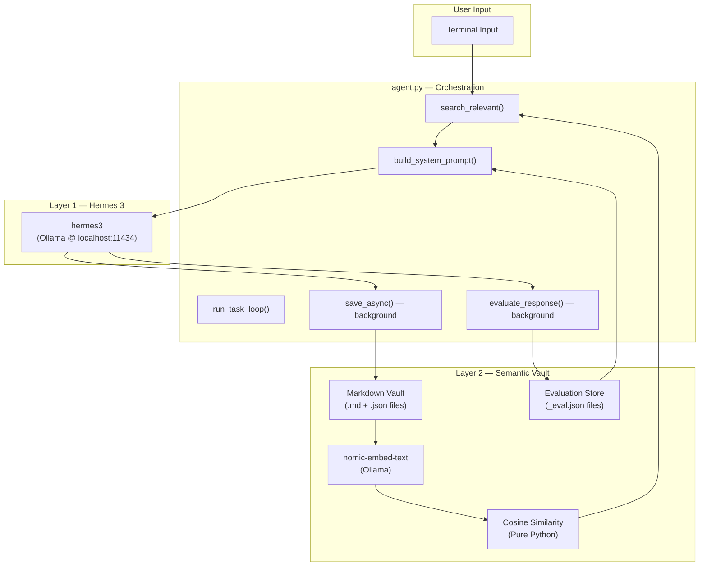
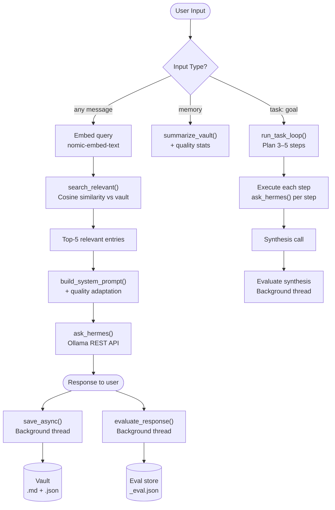

# Hermes + Rowboat: Dual-Layer AI Environment
### Semantic Memory Retrieval & Autonomous Task Execution

---

## Overview

The **Hermes + Rowboat Dual-Layer AI Environment** is a fully local, privacy-first AI agent system. It integrates a **Semantic Memory Vault** with **Hermes 3** (Nous Research) to provide context-aware responses that persist and improve across sessions.

The system is purpose-built to eliminate the core failure of standard AI tools — losing all context when closed — by applying embedding-based retrieval, session-aware memory labelling, and a self-evaluation feedback loop that dynamically adapts the reasoning prompt over time.

---

## System Specifications

| Parameter | Value |
|:---|:---|
| Reasoning Model | `hermes3` (Nous Research via Ollama) |
| Embedding Model | `nomic-embed-text` (Ollama) |
| Memory Format | Local Markdown Vault + JSON Embedding Vectors |
| Retrieval Mode | Semantic (Cosine Similarity) |
| Evaluation | Self-scoring loop (1–10 per response) |
| Dependencies | Python Standard Library only — zero pip installs |
| Support OS | Windows / macOS / Linux |

---

## Memory Pipeline

> [!IMPORTANT]
> Context is retrieved semantically on every query — the system does not replay the last N messages. It finds the most relevant past entries across all sessions and injects only those into the prompt.

**Step 1: Query Embedding (`memory.search_relevant`)**
```python
# Embed the current query using nomic-embed-text
query_vec = _embed(user_input)
```

**Step 2: Cosine Similarity Retrieval (`_cosine`)**
```python
# Score every vault entry against the query vector
score = _cosine(query_vec, entry["embedding"])
```

**Step 3: Context Injection (`summarize_vault`)**
```python
# Return top-5 most relevant entries as formatted context string
context = memory.summarize_vault(query=user_input)
```

**Step 4: Prompt Assembly (`build_system_prompt`)**
```python
# Merge base prompt + quality adaptation note + memory context
system = build_system_prompt() + "\n\n--- RELEVANT MEMORY CONTEXT ---\n" + context
```

**Step 5: Reasoning (`ask_hermes`)**
```python
# Send assembled prompt + user input to Hermes via Ollama REST API
response = ask_hermes(user_input)
```

**Step 6: Parallel Save & Evaluate**
```python
# Non-blocking — both run in background daemon threads
memory.save_async("hermes", response)
threading.Thread(target=evaluate_response, args=(user_input, response)).start()
```

### Supported Interaction Modes

| Mode | Trigger | Behaviour | Output |
|:---|:---|:---|:---|
| CHAT | Any message | Semantic retrieval + single response | Contextual answer |
| TASK | `task: <goal>` | Autonomous step planning + execution + synthesis | Multi-step report |
| RECALL | `memory` | Session-aware vault view + quality stats | Labelled history |

> [!WARNING]
> **Evaluation Latency**: The self-evaluation thread runs a second Ollama inference after every response. If you send the next message immediately, it queues behind the evaluation. For best results, allow ~10 seconds between messages when inspecting quality stats.

---

## Sample Output

The system provides a clean terminal interface. The example below shows a full task loop execution with 5 autonomous steps.

```text
=== Hermes + Rowboat Dual-Layer AI Environment ===
Hermes  : reasoning engine (Nous Research via Ollama)
Rowboat : semantic memory layer (local Markdown vault + embeddings)
Commands : 'memory' | 'task: <goal>' | 'quit'

You: task: Compare supervised and unsupervised learning with real-world examples

[AGENT] Decomposing goal: Compare supervised and unsupervised learning with real-world examples

[AGENT] 5 steps planned:
  1. Define key characteristics of supervised and unsupervised learning
  2. Provide a real-world example for each type
  3. Discuss the role of labeled data
  4. Highlight typical applications and industries
  5. Summarise main differences

[STEP 1/5] Define key characteristics of supervised and unsupervised learning
  -> Supervised Learning uses labeled training data. The algorithm learns to map
     input data to known output labels...

[STEP 2/5] Provide a real-world example for each type
  -> Supervised: A bank uses historical loan data (labeled approved/rejected)
     to train a credit risk model...

[STEP 3/5] Discuss the role of labeled data
  -> Supervised learning requires labeled training data where both input
     features and output values are provided...

[STEP 4/5] Highlight typical applications and industries
  -> Healthcare: diagnosis models (supervised). Retail: customer segmentation
     (unsupervised)...

[STEP 5/5] Summarise main differences
  -> Key differences: labeled vs unlabeled data, known vs discovered output,
     prediction vs pattern finding...

[AGENT COMPLETE]
In conclusion, supervised learning maps known inputs to outputs using labeled
data, while unsupervised learning discovers hidden structure in unlabeled data.
Real-world: credit scoring (supervised) vs customer clustering (unsupervised).

You: memory

--- MEMORY VAULT (session view) ---
=== NEW SESSION ===
[CURRENT SESSION] [USER]: task: Compare supervised and unsupervised...
[CURRENT SESSION] [AGENT]: Task: Define key characteristics...
...

--- QUALITY STATS ---
Evaluations : 8
Average     : 8.2/10
Recent avg  : 9.0/10
Trend       : improving
---
```

---

## System Architecture

### Component Overview



### Logical Flow



### Design Principles

> [!TIP]
> **Design Philosophy**
> 1. **Relevance > Recency**: In memory systems, what was said last is not necessarily what matters now. The system retrieves by semantic similarity, not timestamp.
> 2. **Non-Blocking Execution**: Embedding generation and self-evaluation run in background threads so the user never waits for memory writes.
> 3. **Local Privacy**: The entire pipeline — embedding, retrieval, reasoning, and evaluation — runs locally on Ollama. No data leaves the device.
> 4. **Self-Improvement**: Quality scores accumulate across sessions and feed back into the system prompt, making the agent progressively more accurate.

---

## Installation

**1. Install Ollama** from [https://ollama.com](https://ollama.com) and start it:
```bash
ollama serve
```

**2. Pull the required models (one-time downloads):**
```bash
ollama pull hermes3
ollama pull nomic-embed-text
```

**3. Navigate to this folder:**
```bash
cd hermes-rowboat-env
```

**4. Run:**
```bash
python agent.py
```

> [!IMPORTANT]
> No `pip install` required. The entire project uses Python's standard library (`json`, `os`, `re`, `threading`, `urllib`, `datetime`).

---

## Controls & Customisation

| Setting | Location | Default | Effect |
|:---|:---|:---|:---|
| `model` | `config.json` | `hermes3` | Swap to any locally pulled Ollama model |
| `embed_model` | `config.json` | `nomic-embed-text` | Embedding model for semantic search |
| `temperature` | `config.json` | `0.7` | 0 = deterministic, 1 = creative |
| `system_prompt` | `config.json` | (see file) | Base persona and context for Hermes |
| `top_k` retrieval | `memory.py` | `5` | Number of relevant entries injected per query |
| Quality threshold (low) | `agent.py` | `< 6.0` | Score below which system prompt adds improvement note |
| Quality threshold (high) | `agent.py` | `>= 8.5` | Score above which system prompt adds reinforcement note |

---

## Features

### Core Memory Capabilities
- **Semantic Retrieval**: Embeds every query and finds the top-5 most cosine-similar vault entries — not the last N messages.
- **Session Awareness**: Writes a session marker on startup so `memory` command correctly labels `[CURRENT SESSION]` vs `[PREVIOUS SESSION]` entries.
- **Persistent Vault**: All entries survive across restarts as `.md` + `.json` pairs. The system builds intelligence over time.
- **Evaluation Store**: Each response is scored 1–10 and stored as a separate `_eval.json` file, excluded from semantic search but used for quality stats.

### Implementation Details
- **`memory.search_relevant(query, top_k)`**: Embeds the query, scores all `.json` vault entries via cosine similarity, returns top-k ranked results.
- **`memory.save_async(role, content)`**: Writes the `.md` file and generates the embedding in a background daemon thread — non-blocking.
- **`memory.save_eval(score, reasoning)`**: Stores a structured quality record as `_eval.json` with score, reasoning, question, and response preview.
- **`memory.get_quality_stats()`**: Reads all `_eval.json` files, computes average and recent average, and returns a trend label (`improving`, `stable`, `declining`).
- **`agent.build_system_prompt()`**: Reads quality stats and dynamically appends an adaptation note when the rolling average is below 6.0 or above 8.5.
- **`agent.run_task_loop(goal)`**: Sends the goal to Hermes with a strict JSON-array planner prompt, parses the step list, executes each step with memory context, and synthesises a final summary.

---

## Persistence & Data

| File / Directory | Description |
|:---|:---|
| `memory/*_user.md` | User messages — readable text with frontmatter |
| `memory/*_user.json` | User message embedding vectors (768 floats) |
| `memory/*_hermes.md` | Hermes responses — readable text with frontmatter |
| `memory/*_hermes.json` | Hermes response embedding vectors |
| `memory/*_eval.json` | Quality scores — structured JSON, no `.md` pair |
| `memory/*_system.md` | Session start markers — used for session labelling |
| `config.json` | All runtime configuration |

---

## Project Structure

```
hermes-rowboat-env/
├── agent.py          # Orchestration — input loop, Hermes calls, task loop, eval threading
├── memory.py         # Memory layer — embed, save, search, evaluate, summarise
├── config.json       # All configuration (model, temperature, embed model, system prompt)
├── README.md         # Project documentation (you are here)
└── memory/           # Auto-created vault
    ├── *_user.md           ← user messages
    ├── *_user.json         ← user message embeddings
    ├── *_hermes.md         ← hermes responses
    ├── *_hermes.json       ← hermes response embeddings
    ├── *_agent.md          ← task loop step results
    ├── *_agent_summary.md  ← task loop final syntheses
    └── *_eval.json         ← quality scores (no .md pair)
```

---

## This System vs Cloud AI Tools

> [!TIP]
> The most common question is: *"Why not just use ChatGPT or Claude?"* This table answers that directly.

| Concern | Cloud AI (ChatGPT, Claude, etc.) | This System |
|:---|:---|:---|
| **Memory across sessions** | Forgotten unless you pay for memory features | Persistent across every session, always |
| **Data privacy** | Conversations sent to and stored on external servers | Everything stays on your machine — localhost only |
| **Internet required** | Yes — always | Only for initial model download. Fully offline after that |
| **Cost** | Subscription or API credits | Free — runs on your own hardware |
| **Context relevance** | Last N messages in the window | Semantically retrieved — finds what matters, not just what's recent |
| **Autonomous tasks** | Requires plugins or paid tiers | Built-in `task:` loop, no add-ons needed |
| **Customisation** | Limited to settings provided | Full access — change model, prompt, temperature, retrieval depth |

> [!WARNING]
> **Trade-off**: Cloud models (GPT-4, Claude Opus) are significantly more capable than `hermes3`. This system prioritises **privacy and persistence** over raw reasoning power. For sensitive or long-running personal projects, the trade-off is worth it. For one-off complex tasks, a cloud model may produce better single-turn answers.

---

## How to Verify the System Is Working

Run these checks after your first session to confirm all three layers are active:

**Check 1 — Reasoning layer (Hermes)**
```bash
ollama list
```
You should see `hermes3` in the list with a size of ~4.3 GB.

**Check 2 — Embedding layer (nomic-embed-text)**
```bash
ollama list
```
You should see `nomic-embed-text` in the list with a size of ~274 MB.

**Check 3 — Memory vault is saving**

After sending one message, check the `memory/` folder:
```bash
ls memory/
```
You should see at least three files: one `_system.md` (session marker), one `_user.md` + `_user.json` pair, and one `_hermes.md` + `_hermes.json` pair.

If the `.json` files are missing, `nomic-embed-text` is not running — pull it with `ollama pull nomic-embed-text`.

**Check 4 — Evaluation layer is storing scores**

After sending 3+ messages, wait 15 seconds then type `memory`. You should see:
```
--- QUALITY STATS ---
Evaluations : 3
Average     : X/10
```
If `Evaluations : 0`, the background eval thread is still running or the evaluation JSON parsing failed. Wait longer and try again.

**Check 5 — Semantic retrieval is working**

Ask about a topic from a previous session. If Hermes references it accurately without you repeating it, the semantic retrieval is pulling relevant vault entries correctly.

---

## Performance Expectations

> [!IMPORTANT]
> All inference runs on your local machine. Speed depends on your hardware (CPU vs GPU, available RAM).

| Operation | Typical Duration | Notes |
|:---|:---|:---|
| First response (cold start) | 20–60 seconds | Model loads into memory on first call |
| Subsequent responses | 5–15 seconds | Model stays loaded between calls |
| Embedding generation | 1–3 seconds | Runs in background — does not block you |
| Self-evaluation | 5–15 seconds | Runs in background — does not block you |
| Task loop (5 steps) | 3–10 minutes | Each step is a full Hermes inference |
| `memory` command | Instant | Reads local files only |

If your machine has a GPU with CUDA support, Ollama will use it automatically and responses will be 3–5x faster. To check:
```bash
ollama ps
```
The output will show whether the model is running on CPU or GPU.

---

## Vault Size & Maintenance

Each exchange produces two files:

| File type | Typical size |
|:---|:---|
| `*_user.md` / `*_hermes.md` | 1–5 KB |
| `*_user.json` / `*_hermes.json` | ~6 KB (768 floats) |
| `*_eval.json` | ~1 KB |

A session of 20 exchanges generates roughly **280 KB** of vault data. After 100 sessions the vault will be around **28 MB** — small enough to never need attention on any modern machine.

**To clear the vault and start fresh:**
```bash
rm memory/*.md memory/*.json
```

> [!WARNING]
> This permanently deletes all memory and evaluation history. The system will behave as if it has never been run before. Quality stats will reset to zero.

---

## Known Limitations

> [!WARNING]
> Understanding these limitations prevents misuse and sets correct expectations.

| Limitation | Detail |
|:---|:---|
| **Self-evaluation bias** | Hermes evaluates its own responses. A single model grading itself tends toward high scores. Scores reflect confidence, not external accuracy. |
| **No internet access** | Hermes only knows what it was trained on (knowledge cutoff applies). It cannot browse the web or access real-time information. |
| **Task loop depends on JSON output** | The `task:` planner asks Hermes to return a JSON array. If the model returns a narrative instead, the system falls back to treating the full goal as a single step. |
| **Vault grows unbounded** | There is no automatic cleanup. Old entries remain forever unless manually deleted. The semantic search may eventually slow slightly with very large vaults (10,000+ entries). |
| **Single-user only** | The vault has no access control. Multiple users sharing the same machine would share the same memory vault. |
| **Reasoning quality ceiling** | `hermes3` is a 4.3 GB local model. It is capable but not comparable to GPT-4 or Claude Opus for complex multi-step reasoning. |
| **Evaluation latency** | Background eval threads queue behind each other. In long sessions, eval results may appear in `memory` stats with a delay of several minutes. |

---

## Frequently Asked Questions

**Why does the `memory` command show double `=== NEW SESSION ===`?**
Each run of `agent.py` writes one session marker. If you have run the agent multiple times, you will see one marker per previous session within the last 10 vault entries. This is expected and harmless — the labels are still correct.

**Why are all evaluation scores 10/10?**
Hermes is evaluating its own responses using the same model. Self-evaluation with a single model tends toward high scores. For more critical scoring, a separate or larger evaluator model would be needed. The infrastructure is fully functional — the scoring just reflects the model's self-assessment.

**What happens if `nomic-embed-text` is not pulled?**
The `_embed()` function catches the exception silently. The `.md` file is still saved, but no `.json` embedding is written. The `memory` command falls back to `load_recent()` (session-aware last 10 entries) instead of semantic search.

**What if Ollama is not running when I start the agent?**
The agent starts normally. The first message you send will throw a `Connection refused` error from `urllib`. Start Ollama with `ollama serve` and rerun `python agent.py`.

**Can I use a different model?**
Yes. Pull any model with `ollama pull <model>` and update `"model"` in `config.json`. The embedding model can also be swapped by updating `"embed_model"` — ensure the replacement model supports the `/api/embeddings` endpoint in Ollama.

---

## Credits

- **Hermes 3**: Reasoning model by [Nous Research](https://nousresearch.com), served locally via [Ollama](https://ollama.com)
- **Rowboat**: Memory vault philosophy inspired by [Rowboat](https://github.com/rowboat-ai/rowboat) (YC S24, Apache 2.0)
- **nomic-embed-text**: Embedding model by [Nomic AI](https://nomic.ai), served via Ollama
